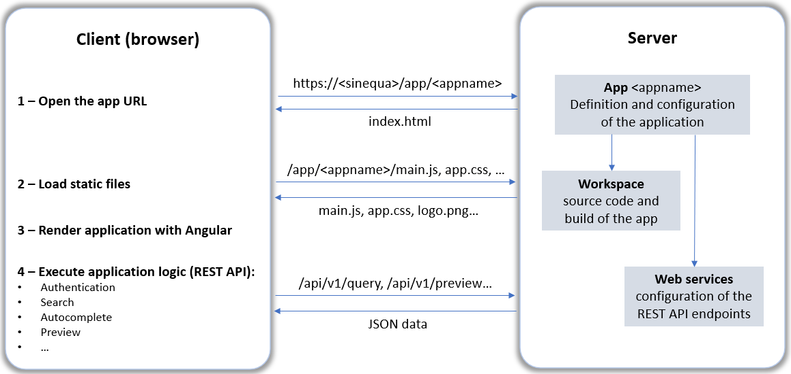
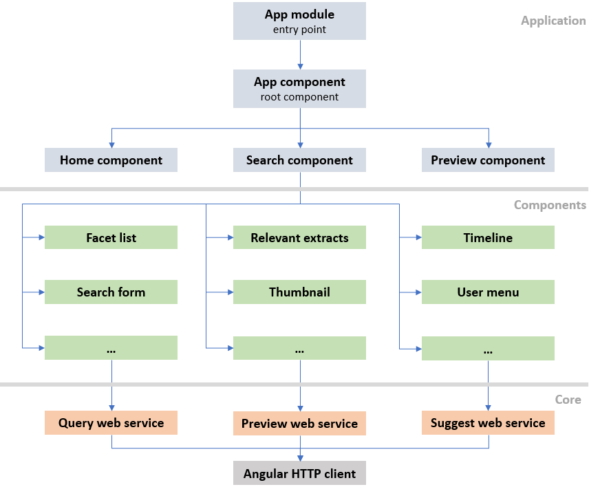
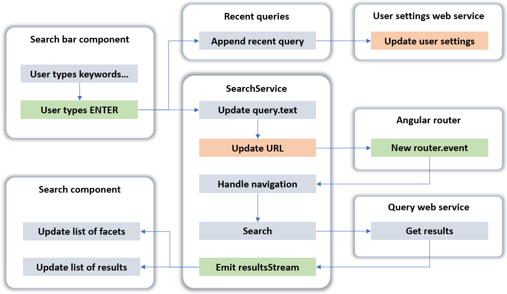

# Architecture

## Overview

Search-Based Applications are [Single-Page Applications](https://en.wikipedia.org/wiki/Single-page_application) (SPAs). The business logic of the application runs in the user's browser. The application is bundled into a static JavaScript file that is downloaded on the application's startup. The application then communicates with Sinequa through its REST API.

This architecture favors a clear separation of concerns between the generic services of the server and the specific business logic of the application. Notice that the application does not strictly need to be deployed on the Sinequa server. It could be deployed on a different server (or even on a CDN) as long as the application can communicate with the Sinequa REST API.

The configuration of the SBA-related components on the server (i.e., app, workspace and web services) is documented in the following guide ([Server Configuration](2-server-config.html)).

## SBA architecture

Angular applications are organized into **components** and **services**. Components are the building blocks of the User Interface. Services manage the application's state and communicate with the server.

The SBA Framework provides a set of components and services that encapsulate Sinequa functionalities. These components and services are packaged into libraries that can be imported into applications.

An application can be seen as the stacking of the following layers that are bound together by the Angular framework:

1. Root components and custom application logic. This layer is specific to the application and can be largely customized by developers. For example, the [Vanilla Search](../apps/2-vanilla-search.html) sample application has 1 top-level component and 3 sub-components (one for each route): the home page, the search page and the document preview page.
2. High-level components and services from the SBA Framework ([Components](../libraries/components/components.html) and [Analytics](../libraries/analytics/analytics.html) libraries). These components and services provide specific Sinequa functionalities. They are designed to be used as-is, but they can also be customized by developers.
3. Low-level interfaces, components and services from the SBA Framework ([Core](../libraries/core/core.html) library). This layer provides the minimum utilities required to communicate with the Sinequa REST API. It is generally not customized by developers.

Theses layers are illustrated in the following diagram:

## State management

All applications have a **state**: what is the user searching for, which filter(s) did they apply, what results are displayed, which document was clicked, etc.

Each piece of state raises the following questions:
- where does the state come from?
- which service or component manages the state?
- what happens when the state changes?
- should the state be persisted, and if so, where? (i.e., saved so that it can be restored later; for example, when the user refreshes the page)

### Where does the state come from?

The state can come from 4 places:

- A call to the Sinequa REST API (e.g., search results).

  ⚠️ Note that prior to user authentication, the application will have no data from the server. A common mistake is calling the server too early (in a `ngOnInit` or `ngOnChanges` method). To avoid this, add an `*ngIf="loginService.complete"` test to components that should only be displayed after the user is authenticated.

- User actions: For example, typing text in the search bar or clicking on a facet modifies the state of the application
- Browser URL: For example, a URL `/hello?query=world` encodes the state of the application (i.e., the page is "hello" and the query is "world"). The URL is "de facto" persisted as it remains the same when the user refreshes the page.
- Local storage: Some state can be persisted in the Browser's local storage, for example, the preference for a dark theme.

### Which service or component stores the state?

In an SBA, the state can exist in various places:

- The `SearchService` stores both the (global) search query and search results (including aggregations). Many components modify `SearchService.query` to change the search criteria, and many components display properties or sub-properties of `SearchService.results` (in particular, `records`: the list of documents and `aggregations`: the list of metadata displayed in facets).
- The [User Settings](../libraries/components/user-settings.html) are a storage system for user preferences and data. User settings are persisted on the Sinequa server and accessible only post-authentication.
- Other state can exist locally within a component class. This state is lost when the component is destroyed (e.g., when the user navigates to another page). In [Vanilla Search](../apps/2-vanilla-search.html), the `SearchComponent` stores the document that is currently displayed in the preview panel.

### What happens when the state changes?

Angular supports different strategies for responding to state changes:

- **Input bindings**: A component can receive data from its parent component (via the syntax `<my-component [inputParameter]="value">`). When the parent component's data changes, the child component is automatically updated (and its `ngOnChanges` method is called). Many SBA components have an `@Input() results` parameter to display data from the search results.
- **Output bindings**: A child component can emit events to its parent component (via the syntax `<my-component (outputEvent)="handler($event)">`). When the child component emits an event, the parent component's handler is called.
- **Events**: Services can emit events that are listened to by components. For example, the Angular router emits events when the URL changes. Similarly, the `SearchService` emits events when the search results are updated.
- **Observables**: [RxJS](https://rxjs.dev/) observables are used to represent asynchronous data streams. For example, the `SearchService` exposes an observable `resultsStream` that emits a new value each time the search results are updated. Observables can be triggered by events and transformed by "pipelines". Angular provides a pipe `async` that can be used to bind an observable to a component's template.

### Should the state be persisted, and if so, where?

In general, the state should be persisted if:

- It is important to the user. For example, the current search query should be persisted if the user refreshes the page, so that they see the same results.
- It cannot be recomputed from other state: For example, the current search results can be recomputed from the search query, so they do not need to be persisted.

The state can be persisted in the following places:

- The URL: Typically, the search query is encoded in the URL. This allows the user to bookmark the page and share the URL with other users. In fact, the `SearchService` listens to URL changes and performs new search queries accordingly.
- [User settings](../libraries/components/user-settings.html) are well-suited for small amounts of data that are specific to the user. For example, the user's preferred language or the list of saved queries.
- Other persistence systems can be used occasionally such as:
  - the browser's local storage (for example, to store the user's preferred theme)
  - Sinequa's engine metadata stores (used to attach custom metadata to documents such as labels)
  - other server-side storage that could be accessed via a custom API endpoint (see for example the [comments module](../libraries/components/comments.md)).

### Example: Searching for text

Here is a typical example of state management in an SBA: The user types text in the search bar and hits enter. The application then performs a search query and stores the query in "recent queries".

This example illustrates various mechanisms of state management:
- Events (user actions, router changes, results update)
- Persistence (URL, user settings)
- Services (search service, user settings service)
- Input bindings (results, facets)
