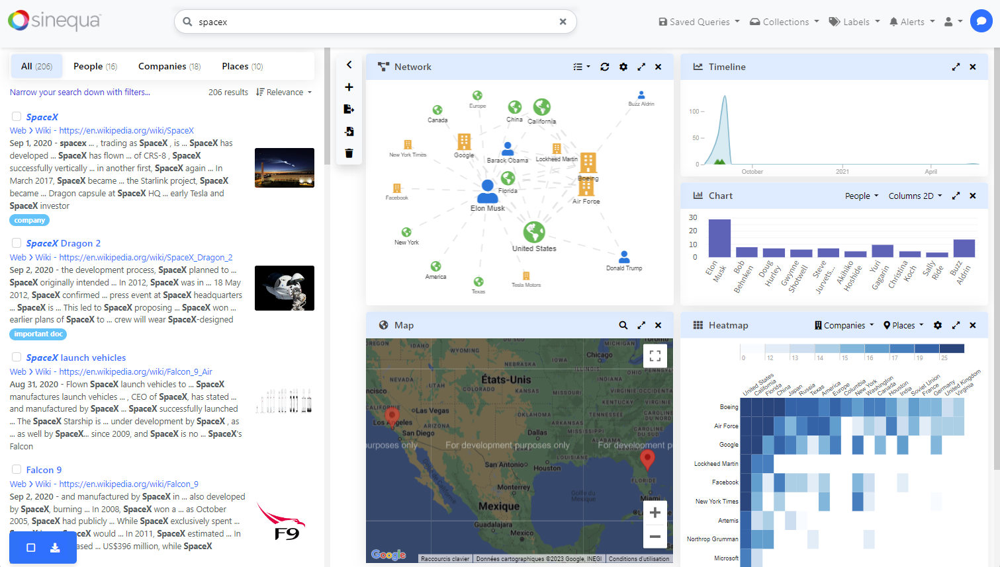

# Dashboard Module

This module is an integration of the [**angular-gridster2**](https://tiberiuzuld.github.io/angular-gridster2/) library.

## Features

The module exports a component that takes in a list of widget configurations and displays these widgets within the `gridster` component. The component handles common operations such as resizing, adding & removing, renaming, and reordering widgets.

The usage of this component is illustrated in the [Pepper](../../apps/3-pepper.md) application.



## Import

Import the standalone dashboard component in your `app.module.ts`.

```ts
import { DashboardComponent } from '@sinequa/analytics/dashboard';

@NgModule({
  imports: [
    ...
    DashboardComponent
```

This component is internationalized: If not already the case, you need to import its messages for the language(s) of your application. For example, in your app's `src/locales/en.ts`:

```ts
...
import {enDashboard} from "@sinequa/analytics/dashboard";

const messages = Utils.merge({}, ..., enDashboard, appMessages);
```

## Usage

The `sq-dashboard` component can be used with this minimal setup:

<doc-dashboard></doc-dashboard>

Notice that you can drag and drop the widgets by clicking on the card header.

In a more typical usage, widgets have a different `type` property that is used to determine what to display.

For example:


```html
<ng-template let-widget>
  <div class="card h-100">
    <div class="card-header">{{widget.title}}</div>
    <div class="card-body" [ngSwitch]="widget.state.type">
      <span *ngSwitchCase="foo">This is a "foo" widget</span>
      <span *ngSwitchCase="bar">This is a "bar" widget</span>
    </div>
  </div>
</ng-template>
```


It is also recommended to use the `sq-facet-card` component from the [Facet Module](../components/facet.md) to encapsulate the widgets. This allows to display built-in "actions" to remove, rename and maximize the widgets:


```html
<ng-template let-widget>
  <sq-facet-card
    [title]="widget.state.title"
    [icon]="widget.icon"
    [collapsible]="false"
    [actions]="widget.actions"
    [actionsFirst]="false"
    [ngSwitch]="widget.state.type">
    ...
  </sq-facet-card>
</ng-template>
```


Thanks to the facet-card API, many functionalities are supported out-of-the-box, like the display of the actions of the child "facet components" (marked with the `#facet` template variable).

Here is a more complete example with two different types of widgets and usage of the facet card:

<doc-dashboard2></doc-dashboard2>

### Sizing

Notice that the sizing of the each type of widget needs to be handled differently, based on whether the component takes all the available space or a fixed given size. The `widget.width` and `widget.height` properties are computed by the dashboard component and recomputed upon resize. The `horizontalPadding` and `verticalPadding` inputs allow to subtract the size of the border and header of the widget.

### Persistence

The widget configurations can be persisted in any storage system (including the browser local storage). Only the `widget.state` should be persisted, as the other properties are computed by the dashboard component.

Therefore, storing the widget configuration could be done like this:

```ts
save(widgets.map(widget => widget.state);
```

And restoring them with:

```ts
widgets = load().map(state => ({
  state,
  maximizable: true,
  removable: true,
  otherProperties: computeFromState(state)
}));
```

(Notice that we avoid storing properties and data that are constant and/or can be re-computed from the state)
